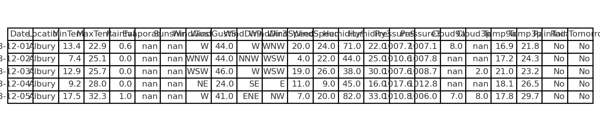
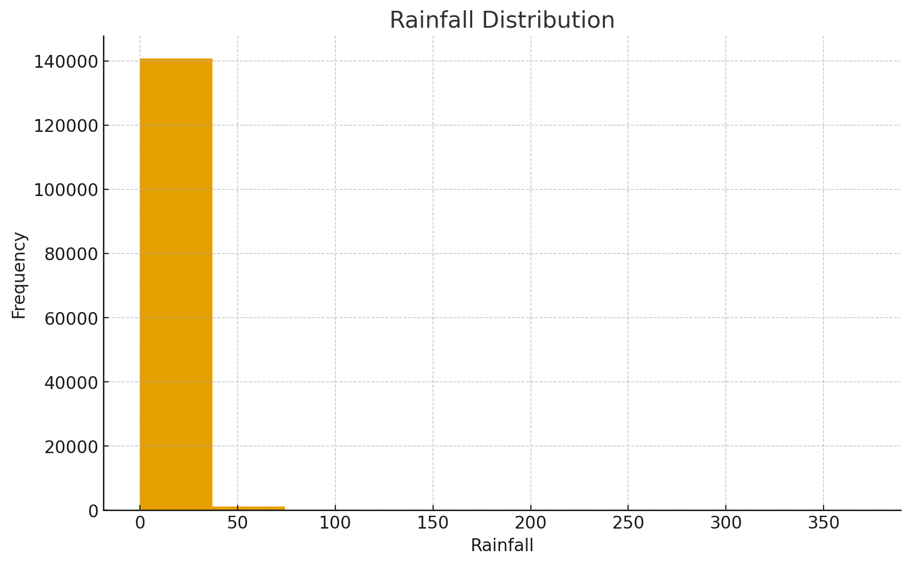
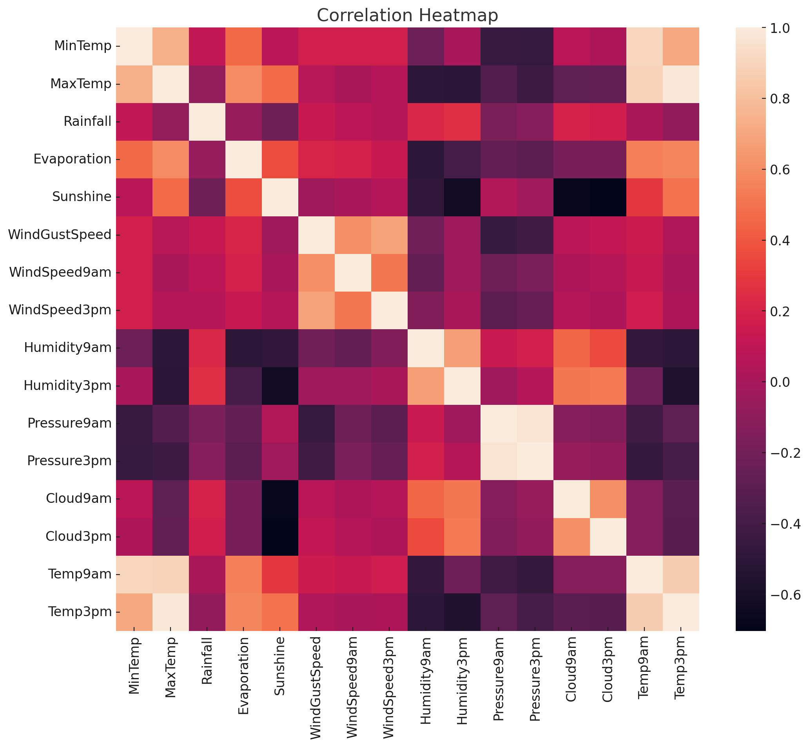
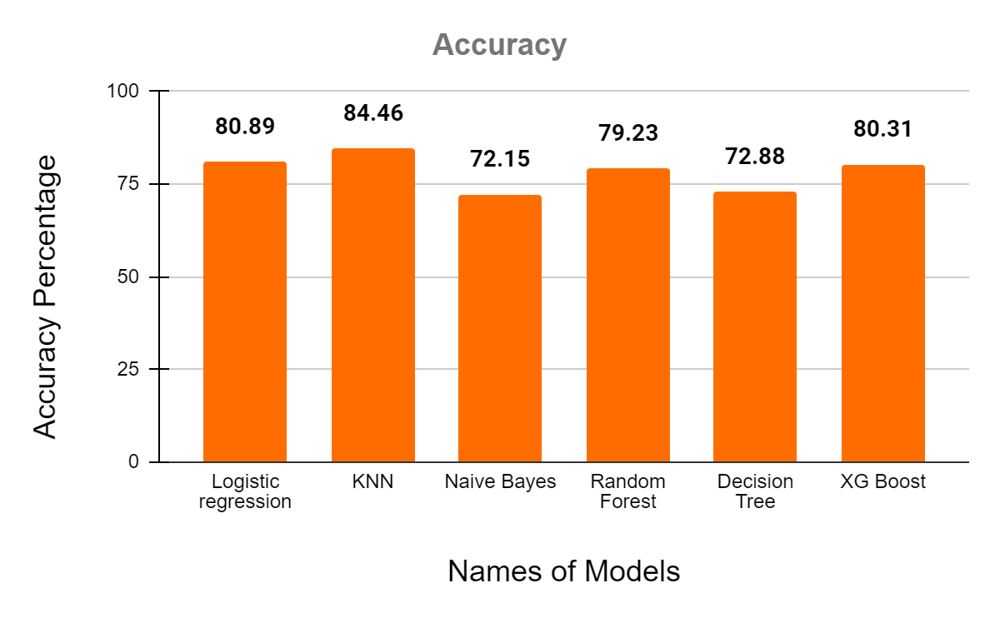

## **📌 Rain Prediction in Australia — Machine Learning & Data Mining Project**


A complete **Knowledge Discovery & Data Mining (CS-513)** course project that predicts **whether it will rain tomorrow in Australia** using a real-world meteorological dataset and several machine learning classification models.

This project performs:

* Exploratory Data Analysis (EDA)  
* Missing value handling  
* One-hot encoding of categorical features  
* Balancing imbalanced classes using **RandomOverSampler**  
* Training & evaluation of multiple ML models  
* Final accuracy comparison  

---

# 🌦️ **Project Overview**

Australia’s weather is extremely diverse and difficult to model. Using historical climate records from **Kaggle’s "WeatherAUS" dataset**, this project builds predictive models to classify whether it will rain the next day.

The final system is designed to:

* Support informed agricultural & environmental planning  
* Demonstrate ML classification model performance  
* Show the full KDD pipeline from raw data → knowledge  

---

# 📁 **Dataset**

Dataset used: **weatherAUS.csv**  
Source: Kaggle — *Weather Dataset from Rattle Package*

Here is a sample of the dataset used:

  
*First few rows of the WeatherAUS dataset*

Key features include:

* Temperature (min/max)  
* Rainfall  
* Sunshine & evaporation  
* Wind direction & speed  
* Humidity  
* Cloud cover  
* Atmospheric pressure  
* Binary rain labels  

---

# 🔎 **Data Preprocessing**

Before balancing, the `RainToday` column was heavily imbalanced:

  
*Class distribution of `RainToday` before oversampling*

| Step                       | Description                                                             |
| -------------------------- | ----------------------------------------------------------------------- |
| Remove date column         | Not useful for prediction                                               |
| Encode categorical columns | One-hot encoding for Location, WindGustDir, WindDir9am, WindDir3pm      |
| Convert labels             | "RainToday" and "RainTomorrow" → 0/1                                    |
| Handle missing values      | Removed all rows with NAs                                               |
| Balance dataset            | Used **RandomOverSampler** from imbalanced-learn to fix class imbalance |

Here’s the distribution of the target variable `RainTomorrow`:

  
*Distribution of `RainTomorrow` after preprocessing*

---

### 🔗 **Correlation Analysis**

A heatmap of feature correlations helps identify strong predictors:

  
*Correlation heatmap of dataset features*

---

# 🤖 **Models Implemented**

| Model               | Accuracy                  |
| ------------------- | ------------------------- |
| Logistic Regression | **0.8089**                |
| KNN (k = 3)         | **0.8446** ⭐ *Best Model* |
| KNN (k = 5)         | 0.8063                    |
| KNN (k = 10)        | 0.7824                    |
| Naive Bayes         | 0.7215                    |
| Random Forest       | 0.7923                    |
| Decision Tree       | 0.7287                    |
| XGBoost Classifier  | 0.8031                    |

**Highest Accuracy:**  

### ⭐ **K-Nearest Neighbors (k = 3) — 84.46%**

---

# 📊 **Model Comparison Visualization**

The following chart compares the performance of all the machine learning models implemented in this project.  
It clearly shows which model achieved the highest accuracy:

  
*Accuracy comparison of all implemented ML models*

---

# 🧪 **Technologies Used**

* Python  
* Jupyter Notebook  
* Scikit-Learn  
* Imbalanced-Learn  
* Pandas / NumPy  
* Matplotlib / Seaborn  
* XGBoost  
* Kaggle Dataset  

---

# 🚀 **How to Run the Notebook**

```bash
# Install dependencies
pip install -r requirements.txt

# Open Jupyter Notebook
jupyter notebook KDD_Project_Aus_Rain_Prediction.ipynb
